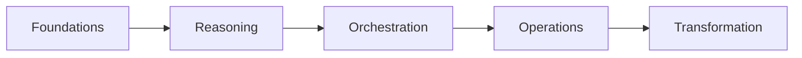

<p align="center">
  
</p>

<h1 align="center">FrootAI</h1>
<p align="center"><strong>From the Roots to the Fruits</strong></p>
<p align="center"><em>Open AI architecture ecosystem for Infra, Platform & App teams.</em></p>

<p align="center">
  <a href="https://frootai.dev"></a>
  <a href="https://github.com/frootai/frootai"></a>
  <a href="https://www.npmjs.com/package/frootai-mcp"></a>
  <a href="https://marketplace.visualstudio.com/items?itemName=pavleenbali.frootai"></a>
  <a href="https://pypi.org/project/frootai/"></a>
  <a href="https://github.com/frootai/frootai/blob/main/LICENSE"></a>
</p>

---

### What is FrootAI?

**FROOT** = **F**oundations  **R**easoning  **O**rchestration  **O**perations  **T**ransformation

We provide the architecture knowledge, production tooling, and deployable solutions that bridge the gap between AI infrastructure and AI applications.

<p align="center">
  
</p>

---

### Get Started

```bash
npx frootai-mcp@latest                          # MCP Server
code --install-extension pavleenbali.frootai     # VS Code Extension
pip install frootai                              # Python SDK
docker run -i ghcr.io/frootai/frootai-mcp        # Docker
```

---

### What Ships Inside

| | Component | What | Install | Links |
|:--:|-----------|------|---------|-------|
|  | **MCP Server** | 23 tools for any AI agent | `npx frootai-mcp` | [Website](https://frootai.dev/mcp-tooling)  [npm](https://www.npmjs.com/package/frootai-mcp) |
|  | **VS Code** | Browse plays, scaffold projects | `pavleenbali.frootai` | [Website](https://frootai.dev/vscode-extension)  [Marketplace](https://marketplace.visualstudio.com/items?itemName=pavleenbali.frootai) |
|  | **Python SDK** | Offline knowledge, evaluation | `pip install frootai` | [PyPI](https://pypi.org/project/frootai/) |
|  | **Python MCP** | 23 tools, pure Python | `pip install frootai-mcp` | [PyPI](https://pypi.org/project/frootai-mcp/) |
|  | **Docker** | Zero-install MCP server | `ghcr.io/frootai/frootai-mcp` | [Website](https://frootai.dev/docker)  [GHCR](https://github.com/frootai/frootai/pkgs/container/frootai-mcp) |
|  | **CLI** | Init, search, cost, validate | `npx frootai` | [Website](https://frootai.dev/cli) |
|  | **Solution Plays** | 20 pre-tuned AI solutions |  | [Browse](https://frootai.dev/solution-plays) |
|  | **Knowledge** | 16 FROOT modules |  | [Docs](https://frootai.dev/docs) |

---

---

### Repositories

| Repo | Description |
|------|-------------|
| [**frootai**](https://github.com/frootai/frootai) | Main toolkit  MCP, VS Code, Python, CLI, 20 plays, 16 modules |
| [**frootai.dev**](https://frootai.dev) | Official website |

---

<details>
<summary><strong>The FROOT Framework</strong></summary>
<br>



| Layer | What You Learn |
|:-----:|---------------|
|  F | Tokens, models, glossary, Agentic OS |
|  R | Prompts, RAG, grounding, deterministic AI |
|  O | Semantic Kernel, agents, MCP, tools |
|  O | Azure AI Foundry, GPU infra, Copilot ecosystem |
|  T | Fine-tuning, responsible AI, production patterns |

</details>

---

<p align="center">
  <a href="https://frootai.dev">Website</a>  
  <a href="https://frootai.dev/chatbot">Agent FAI</a>  
  <a href="https://frootai.dev/docs">Docs</a>  
  <a href="https://github.com/frootai/frootai/issues">Issues</a>
</p>
<p align="center"><em>It's simply Frootful.</em> </p>
